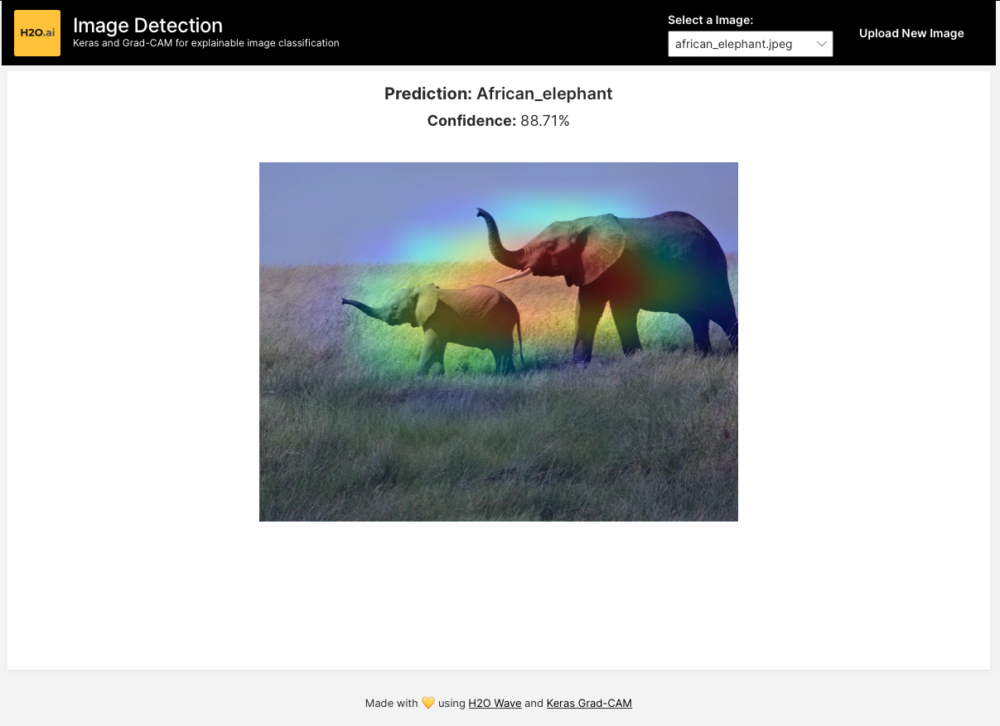
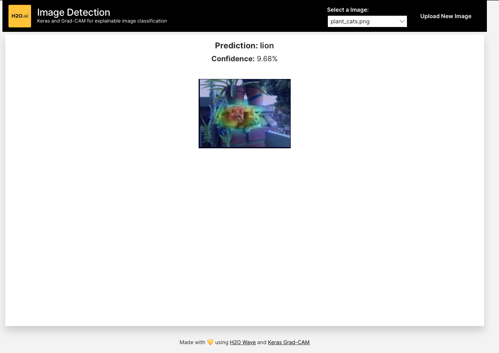
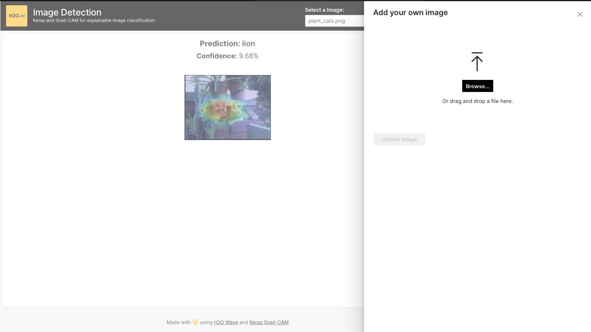

# Image Detection with Keras and Wave

Using open source Keras and Grad-CAM the user can upload their own photos 
and get explainable predictions of what a standard, pre-trained model 
thinks is in the image. This app makes these open source tools more 
accessible by adding a easy-to-use front end.

This app can be used as a template for Wave App developers on how to 
integrate third-party modeling frameworks into your own apps.






## Local Development

Create a python environment in the home app directory and install requirements. Python 3.7 is recommended but not 
required.

```shell script
python3 -m venv venv
./venv/bin/pip install -r requirements.txt
```

When running this application locally, ensure that you are using the parameter 
for pointing to the `images/` folder so that these files will be automatically 
available in the Wave serve. 
```shell script
H2O_WAVE_PUBLIC_DIR="/images/@/Users/mtanco/h2o_wave/apps/wave-grad-cam/images" ./venv/bin/wave run src.app

```

Visit the app at http://localhost:10101

## Publish to the AI App Store
After configuring your h2o CLI to a specific environment, you can upload 
this app using
```shell script
h2o bundle import
```